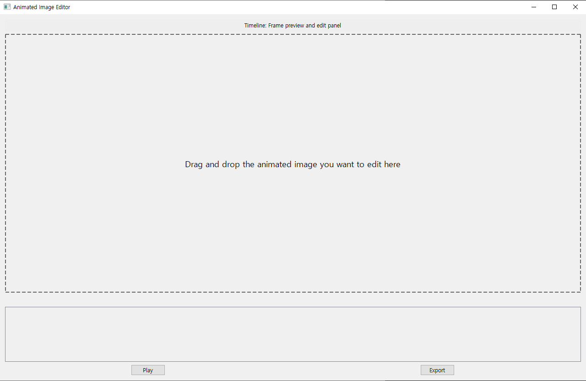
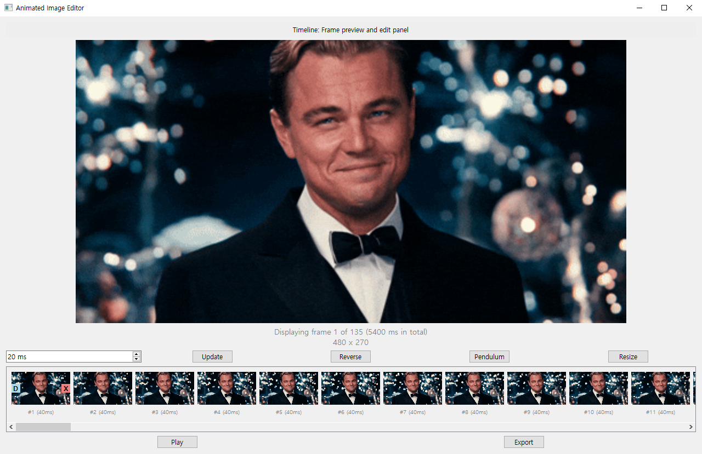

# AnimatedImageEditor
An editor for animated images (GIF/WEBP)
## Features
1. Adjusting frame durations
2. Deleting/Duplicating key frames
3. Manipulating frame order
4. Playing backward or back and forth
5. Resize/Crop/Merge/Concatenate multiple images

## Usage
### Start editing

Drag and drop an image to start editing
 
 
 
 
 
### Editing an image

***Play***: Play the animation in the preview section

***Export***: Save the edited image

***Update***: Add the value on the left (in millisecond, can be negative value) to the selected key frames' frame duration

***Reverse***: Make the image play backward

***Pendulum***: Make the image play back and forth

***Resize***: Resize the image to have desired height. The original ratio will be preserved

***Crop***: Drag and select an area in the preview section to crop the image

 
 
 
 
 
### Merge and Concatenate
You can drag and drop another image on the existing image to start merge/concatenate

***Merge***: Merge two images, those two will be played side by side

***Concatenate***: One will be played after the other

When you merge or concatenate, you ***DO NOT*** need to match the frame durations/image dimensions/# of frames.

The program will optimize those to produce best output.

But having same frame durations/image dimensions/# of frames for the two images will likely produce better output.
